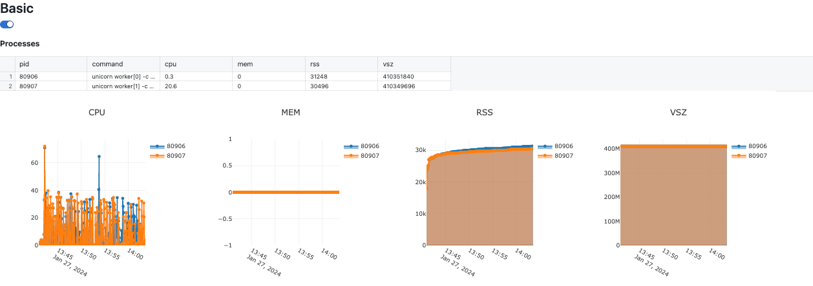
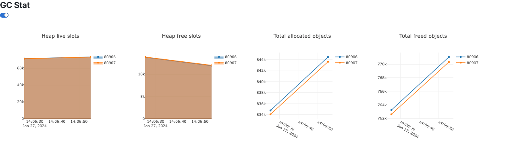
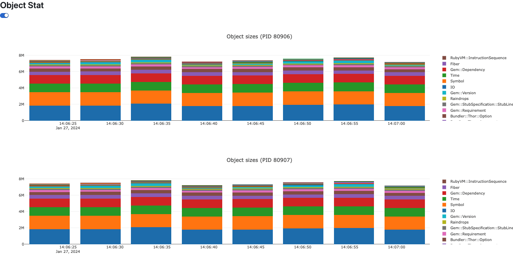
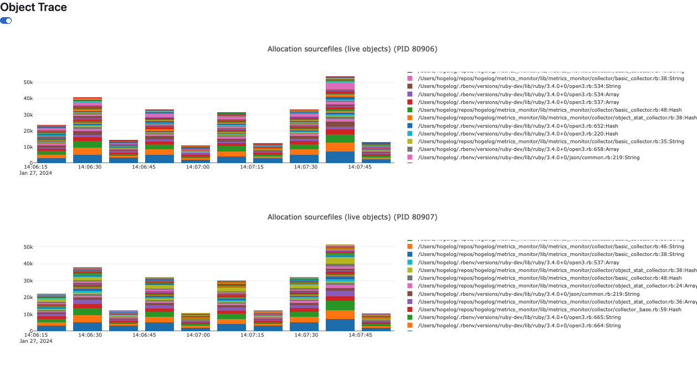
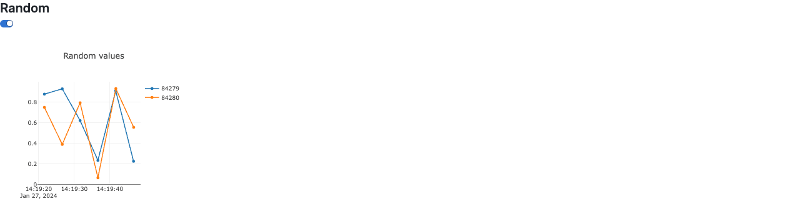

# MetricsMonitor

MetricsMonitor is dynamic monitoring tool for ruby application.

## Features
- Monitor multi process ruby application
- Monitor basic metrics by builtin collector
- Monitor custom metrics
- Save monitoring result to single html file

## Installation

Add this line to your application's Gemfile:

```ruby
gem "metrics_monitor", require: "metrics_monitor/setup"
```

If you want to customize, add this line to your application's Gemfile:

```ruby
gem "metrics_monitor"
```

and configure like this:

```ruby
require_relative "metrics_monitor"

MetricsMonitor::Collector::ObjectStatCollector.configure do |options|
  options[:interval] = 5_000
  options[:memsize_threshold] = 5000
end

MetricsMonitor.configure do |config|
  config.collectors << MetricsMonitor::Collector::ObjectStatCollector
  config.exclude_main_process = true
end
```

## Configuration
### MetricsMonitor config
- `collectors`: Array of collector class
- `exclude_main_process`: Exclude main process from monitoring (when using multi process application)

### Collector config
- `enabled`: Enable or disable collector when starting
- `interval`: Interval of collecting metrics (ms)
- other options: Depends on collector

### Multi process application
MetricsMonitor can monitor multi process application.

When using multi process application, you should start MetricsMonitor in each processes.

If you use `unicorn`, you can start MetricsMonitor like this:

```ruby
after_fork do |_server, worker|
  MetricsMonitor.monitor.watch(worker.nr)
end
```

You could set `exclude_main_process` to `true` in MetricsMonitor config to exclude main process from monitoring.

## Collectors
### BasicCollector
Basic metrics collector like cpu, memory and etc.




### GcStatCollector
Garbage collection statistics collector.



### ObjectStatCollector
Object statistics collector.



### ObjectTraceCollector
Object tracing data collector.



### Custom collector
You can create custom collector by referring to [lib/metrics_monitor/collector](lib/metrics_monitor/collector).

Below is an example of a custom collector.


```ruby
class RandomCollector < MetricsMonitor::Collector::CollectorBase
  def self.default_options
    { enabled: true, interval: 5_000 }
  end

  def meta_data
    {
      title: "Random",
      monitors: [
        { key: :random, title: "Random values", type: :chart, mode: :line },
      ],
      data: {
        random: { mode: "append" },
      },
    }
  end

  def data
    {
      random: rand,
    }
  end
end
```

This collector generates random values and displays them in a chart.



## Contributing

Bug reports and pull requests are welcome on GitHub at https://github.com/hogelog/metrics_monitor.


## License

The gem is available as open source under the terms of the [MIT License](https://opensource.org/licenses/MIT).
